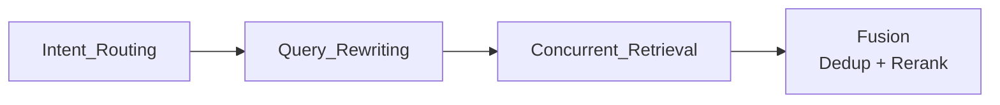

# 需要补充的知识

docker compose服务编排

fastapi

text2sql

---

# Anything

## ChatGPT的内存记忆系统

没有使用向量数据库，也没有对对话历史进行RAG处理。而是使用四个不同的层：能够适应环境的会话元数据、长期存储的明确事实、近期聊天记录的轻量级摘要、显示当前对话的滑动窗口。

### 会话元数据

在会话开始时一次性注入该数据，不会被永久存储，也不会进入长期记忆。在会话结束后不会保留。

```plaintext
Session Metadata:
- User subscription: ChatGPT Go
- Device: Desktop browser
- Browser user-agent: Chrome on macOS (Intel)
- Approximate location: India (may be VPN)
- Local time: ~16:00
- Account age: ~157 weeks
- Recent activity:
    - Active 1 day in the last 1
    - Active 5 days in the last 7
    - Active 18 days in the last 30
- Conversation patterns:
    - Average conversation depth: ~14.8 messages
    - Average user message length: ~4057 characters
    - Model usage distribution: # 近期模型使用分布
        * 5% gpt-5.1
        * 49% gpt-5
        * 17% gpt-4o
        * 6% gpt-5-a-t-mini
        * etc.
- Device environment:
    - JS enabled
    - Dark mode enabled
    - Screen size: 900×1440
    - Page viewport: 812×1440
    - Device pixel ratio: 2.0
- Session duration so far: ~1100 seconds
```

### 用户内存

专门的工具用于存储和删除用户的稳定、长期信息，这些信息不断积累最终形成一个持久的“用户画像”。在得到用户明确要求存储（在内存中存储事实或删除事实）或者系统自动识别的重要信息，这些记忆会以独立模块的形式注入到未来的每一个提示信息中，持久跨会话存在。例如：姓名、职业、偏好、长期目标等关键信息。

### 近期会话摘要

保存最近约15个对话的轻量级摘要列表（包含时间戳、标题和用户消息片段），使AI能够在不提取完整聊天记录的情况下，保持聊天之间的连贯性。通过牺牲详细的上下文方式换取速度和效率。

### 当前会话窗口

即时上下文：当前对话的完整上下文。采用“滑动窗口”机制，当对话过长超出token限制时，最早的消息会被删除（但记忆信息和对话摘要仍会保留）。保证当前对话逻辑的严密和连贯。窗口随会话结束或超长而滚动。

传统RAG需要对每一次查询在历史记录中进行搜索，计算成本高且延迟大。ChatGPT 的策略是——“记住重要事实（层级2），了解近期话题概况（层级3），专注当前对话细节（层级4）”。关键在于，并非所有信息都需要以传统意义上的“记忆”形式存在。会话元数据会根据环境实时调整。明确的事实会在会话之间保留。对话摘要提供连贯性，但不会包含细节。当前会话也保持着一致性。这些动态组件——每个组件都会随着会话的进行和偏好的变化而更新。

## 记忆

记忆是基础设施。
将对话历史记录塞入上下文，经过十轮对话后，上下文信息会被填充，旧记忆会被截断，智能体会忘记某些内容。
向量数据库检索：当对话内容增多，数据库中存在大量记录；用户询问某个事实，结果返回多条互相矛盾的片段。这是因为嵌入向量衡量的是相似性，向量数据库无法理解时间、上下文或更新信息。

短期记忆：检查点
每个代理都以状态机的形式运行。检查点是特定时刻整个状态的快照，提供：确定性重放、崩溃恢复和回溯调试功能。

长期记忆架构A：基于文件的自组织系统
三层结构：
资源：原始数据、不可更改、带时间戳
项目：原子事实
分类：不断更新的摘要
写入时主动处理：新信息不仅会被归档，还会融入到现有摘要中。阅读时采用分组检索。

长期记忆架构B：上下文图
混合结构：向量存储用于发现相似文本，知识图谱用于精确的主谓宾关系。
冲突解决：识别出矛盾点，将旧链接存档为历史记录，并更新当前的关系。
混合检索：向量搜索+图遍历并行运行，并将结果合并。

合并冗余数据，提高高频访问项目的优先级；将旧事实压缩成高层次的见解，清理 90 天内未访问过的记忆；重建嵌入、调整图边权重、归档冷数据

推理过程中的检索 从上下文窗口的限制条件出发，反向推导： 1. 使用合成查询进行广泛搜索 2. 搜索结果是候选答案，而非最终答案。 3. 相关性得分 × 时间衰减 = 最终排名 4. 近期的记忆往往比六个月前的完美匹配更准确 结果：仅注入 5-10 个真正有用的记忆。

将代理程序视为操作系统，而不是聊天机器人： 
· RAM：为当前对话提供快速、瞬态的上下文 
· 硬盘：持久化的、索引式的知识存储 
· 垃圾回收：定期维护或系统崩溃

记忆分层：记录当前任务的便签、记录会话的每日日志、存档用户分享的信息存档

对话记忆——仅在当前回合中才重要的工具调用或思路链；会话内存——多步骤任务（引导流程、调试会话）完成后应重置；用户记忆——个人偏好、账户状态或合规性详情必须在交互过程中保持不变。

为记忆设置有效期：处理仅在特定时间段内相关的信息；管理与当前事件相关的信息，这些在事件发生后变得无关紧要。过期后的记忆将无法在搜索结果中检索到，尽管仍然存储在系统中。

### agent记忆架构

纯滑动窗口会丢失早期核心信息，纯向量检索对强事实数据的召回率不可控，易引发幻觉。

异构多级缓存与事件驱动架构：

- 短期记忆：redis双层缓存
	- 高频对话流：保留最近5-10轮原始对话，保障基础上下文连贯。
	- session级动态状态机：用小模型实时抽取关键实体写入system prompt（user.md），会话不断，核心信息不丢。
- 长期记忆：异构混合检索
	- 强事实标签：mysql存储，零容错，最高优先级
	- 半结构化长文本：es，bm25算法关键字精确召回
	- 非结构化模糊语义：向量数据库，仅作发散性经验语义补充，优先级最低

记忆流转：异步事件驱动

- 主链路：多路并发召回和组装，要求500ms内响应
- 旁路更新：通过MQ异步解耦。检测到“状态变更”才触发落盘，实现读写分离与惰性更新

一致性兜底：通过会话内状态永久优先和双写redis临时缓存兜底，结合版本号乐观锁防止脏数据覆盖。

## 继承和重写

方法重写规则：当子类重写了父类中的方法时，实例self调用该方法会优先使用子类的版本。（python的方法解析顺序MRO：从子类开始向上查找方法定义）

## agents.md

一个简单、开放的AI编程助手指导格式。专门为AI代理准备的README文件，提供了一个专门的、可预测的位置，用来存放帮助AI编程代理理解和操作你项目的上下文信息和指令。

文件位置层级

* **当前工作目录的AGENTS.md**（最高优先级）
  * 直接影响当前操作的文件和目录
  * 适用于特定功能模块的定制化配置
* **子目录中的AGENTS.md**（针对特定模块）
  * 为特定子系统提供专门的配置
  * 在处理该目录下的文件时自动生效
* **父目录中的AGENTS.md**（项目级配置）
  * 提供项目范围的通用配置
  * 最常见的配置位置

配置合并策略：非冲突配置，不同层级的配置信息合并；冲突配置，高优先级配置覆盖；列表类配置，采用追加模式合并成完整列表。

## A2A

agent-to-agent 指代理与代理之间的直接通信或协作范式，强调去中心化的能力发现、消息转发与自治交互，适用于允许任何agent动态加入或离开的网络环境。

## subagnet+skills

[Subagent+Skills的最佳实践](https://mp.weixin.qq.com/s/dHyiq1mAHv61FHDpbbPL5Q)

通过subagent和skills结合，设计agent流水线。

agent在一个环境里，按照要求使用工具完成任务，同时对做过的任务具有记忆。使用skills让agent掌握一项技能，本质上是一种上下文卸载的工程策略。将复杂任务拆分成不同的子任务，每个子任务对应不同的skills，调用subagent专注于一个具体的skills来执行子任务，稳定其输出结果。

```plaintext
├── SKILL.md (required) - 技能描述
├── reference.md (optional documentation) - 参考文档
├── examples.md (optional examples) - 使用案例
├── scripts/
│   └── helper.py (optional utility) - skills 里可以运行的代码脚本
└── templates/
    └── template.txt (optional template) - skills 的模板

skills.md（工作流+脚本+MCP等工具的打包，类似操作手册）
---
name: your-skill-name
description: 简要描述该技能的作用以及何时使用它
# name和description在启动时会预加载到agent提示符中。
---
# Your Skill Name
## 指令
为 Claude 提供清晰、一步一步的指导。
## 使用案例
展示使用这个 Skills 的具体示例。
```

skills是由指令、脚本和资源组成的有序文件夹，agent可以动态发现并加载这些文件夹，完成特定任务。把特定工作流、特定领域的能力打包成可复用的技能包。

价值：可复用（写一次，以后每次相关任务自动触发）、可组合（不同skill可拼接，单独提示词做不到模块化组合）、可迭代（agent帮改skill）、可渐进加载（skill的资源文件一开始不会占用上下文，提示词是全量加载）

skills编写实用指南：

- 首先进行评估：通过让智能体执行代表性任务，观察它们在哪些方面遇到困难或需要更多上下文信息，从而找出智能体能力的具体不足之处，然后逐步提升智能体的技能，以弥补这些缺陷。
- 为了便于拓展，结构设计应考虑：当skill.md文件变得过于庞大时，应将其内容拆分为多个单独的文件并分别引用。如果某些上下文互斥或很少同步使用，则保持路径分离可以减少令牌的使用。代码既可以作为可执行工具，也可以作为文档，需要明确agent是直接运行脚本还是将其视为参考信息读取到上下文中。
- 观察agent在实际场景中如何使用skill，并根据观察结果进行迭代。注意是否存在意料之外的轨迹或对特定情境的过度依赖。特别注意skill的name和description。
- 将agent的成功方法和常见错误记录，并将其转化为可复用的技能代码和上下文。

过度封装skill只会增加复杂度。

测试与性能指标：触发率（相关查询的自动加载成功率应达到90%）、效率（对比启用技能前后完成任务所需的工具调用次数和token消耗）、失败率（每个工作流的api调用失败数应趋于0）

常见问题：
- 不触发：通常由于description太宽泛或缺少触发短语
- 过度触发：需在描述中加入负向触发
- 指令未遵循：原因包括指令冗长，指令被埋没在长文中
- 性能退化：同时启用的技能过多，或未利用渐进式披露导致上下文过载

Skill 与 Tool 的区别：Tool 是由代码实现的原子操作（如读写文件、执行命令），Skill 则是基于说明文件的高级工作流，可以组合调用多个 Tool 来完成复杂任务。

## 动态上下文发现

1、将较长的工具响应转换成文件。

工具调用返回的json响应可能显著增加上下文窗口的大小。将输出信息写入文件，让agent读取文件，这样在接近上下文上限时，就能减少不必要的额外总结。

2、在摘要过程中引用对话历史。

当模型的上下文窗口被填满时，agent会触发摘要步骤。但由于摘要是对上下文的有损压缩，agent可能会忘记关键细节。可以将历史对话信息作为文件，当agent发现摘要中缺少必要的细节，可以在历史对话文件中搜索以找回需要的信息。

3、支持agent skills开放标准。

4、高效地仅加载所需的MCP工具。

mcp有助于访问受OAuth保护的资源，比如生产环境日志、外部设计文件或者企业内部的上下文和文档。mcp服务器可能包含很多工具，且往往带有很长的描述，这会显著膨胀上下文窗口。通过将工具描述同步到一个文件夹中，agent在调用前只会收到一小段静态上下文（包括工具名称），并在任务需要时再去查找具体工具。这样也可以向agent传达mcp工具的状态。（比如如果某个mcp服务器需要重新认证，agent以前会完全遗忘这些工具，采用该方法后可以主动提示用户进行重新认证）

## 用好AI

1. 梳理目前的工作流，先拆解为一个个动作，再把动作封装成步骤，为不同步骤寻找AI工具。
2. 确定几款AI工具作为组合。警惕陷入折腾工具和学习陷阱。
3. 对于主力工具，使用每个功能、按钮、设置项，并建立工具指南。能充分理解工具并利用全部能力。
4. 记录和维护常用的提示词，并不断优化。提示词可以让AI生成内容更精准，也可以倒逼清晰的思考。
5. 维护类似claude.md文件，记录希望AI怎么工作、AI发生过的错误、遇到错误的解决方式等。
6. 定期清理AI生成的内容。
7. AI辅助办公：/deep-research 不管什么概念，先深度调研；/find-skills 不管什么技能，让agent去学；/plan 计划模式，递归实现

## 使用AI编码代理的5个核心实践经验：

1、始终先进入计划模式：首先用自然语言充分讨论、迭代、明确需求和实现路径。只有在确认智能体已正确理解且方法合理后，才能着手编写代码。显著减少返工、代币浪费和偏离轨道的风险。

2、经常开始新的对话：当话题或任务发生明显转变时，建议另起炉灶，而不是继续把所有内容都塞进一个冗长的对话中。原因：上下文窗口被无关历史严重污染->导致理解偏差、成本增加和指令稀释。

3、让AI也负责代码审查：对于已知的风险区域，使用特定的提示让模型进行检查（例如“扫描此分支中的更改，并确认功能标志之外的代码没有被意外影响”）。

4、同步进行规划，异步地将执行委托给云端：首先，人和智能体迅速就计划达成一致。一旦达成共识，就将具体的实施任务交给后台智能体来执行。

5、建立专用验证环境：让代理在受控的隔离的验证环境中运行测试并验证其自身更改的结果。实现“自检闭环”，减少重复人工验证的负担，提高整体确认性。

## 长时间运行应用程序开发的框架设计

[适用于长时间运行应用程序开发的线束设计](https://www.anthropic.com/engineering/harness-design-long-running-apps)

包含生成器（以主观喜好为标准）和评估器（以可验证的正确性和可用性为标准）的多智能体结构。构建一个能够可靠且有品位地对输出进行评分的评估器，需要首先指定一套标准，将主观判断转化为具体的、可评分的指标。

将构建过程分解为易处理的小块，以及使用结构化工件在不同会话之间传递上下文。架构为规划器、生成器和评估器。

“上下文重置”：完全清除上下文窗口并启动一个新的智能体，同时配合结构化的交接机制（传递前一个智能体的状态和后续步骤）。与压缩不同，压缩会将对话早期的部分进行概括，虽然保持了连续性，但不能让代理重头开始，依然存在上下文焦虑的问题。

自我评价：将执行任务的智能体与评估任务的智能体分开，能降低评估误差。

## BM25算法

是信息检索领域衡量搜索词与文档相关性的核心算法。核心逻辑是通过词频饱和度和文档长度归一化对关键字匹配进行加权评分。TF-IDF中词条频率越高，文档得分越高，单个词条对文档影响较大。BM25让每个词条的算分有上限（TF-IDF改良版）

匹配逻辑：

- 分词：将query拆分为多个关键词
- 倒排索引查询：寻找包含这些关键词的候选文档集
- 计算IDF：确定每个关键词的稀有程度
- 计算各文档得分：
  - 提取该词在当前文档的频率
  - 结合文档长度进行缩放
- 加权求和：将所有关键词的分数累加，得到最终排名

## 管理claude项目

```text
|project/
|-CLAUDE.md（团队指令，提交git）
|-CLAUDE.local.md（个人）
|-.claude/
|--settings.json（权限+配置）
|--settings.local.json（个人权限）
|--commands/
|--rules/
|--skills/
|--agents/
```

CLAUDE.md：claude的行动指南——项目背景、代码规范、注意事项。相当于onboarding文档。

内容多了就拆。把规则按主题拆进rules目录，比如代码风格一份、测试规范一份、安全要求一份。利于维护。

常用流程放在commands。比如“跑一遍lint然后提PR”、“生成变更日志”这种重复性操作，定义成命令，一句话调用。

按上下文自动触发的逻辑放skills。比如打开某类文件时自动执行检查。

需要独立运行的子代理放agents。彼此隔离，不污染上下文。

权限在settings.json里锁死。哪些操作允许、哪些需要确认、哪些直接禁止。

## openclaw

### agent_loop

jsonl持久化的sessionstore、stop_reason、出现错误执行 带退避的重试+上下文保护（message.pop）

迭代流程：1、检查是否需要compact；2、构建prompt；3、发起流式请求；4、实时处理事件流；5、检查stop_reason--tool_use执行工具，end_turn/max_token结束循环；6、构建tool_result_message，追加message数组，进入下一轮。

### tool_use

tools：schema工具列表；tool_handlers：dict，工具名映射到python函数；内层循环；工具执行结果放入user消息中。

### task system

每个任务作为一个json文件，有状态、前置依赖和后置依赖。多个任务组成任务图，状态追踪（pending-in_progress-completed）。在压缩和重启后存活。

### session

sessionstore：jsonl持久化，写入时追加，读取时重放；
contextguard：3阶段溢出重试（正常-工具结果截断-压缩-失败）+ token计数；
压缩：LLM摘要替换旧消息

jsonl文件：临时存储对话中的每轮信息；
memory/YYYY-MM-DD.md：当天的笔记文件，记录发生的事情，提炼自jsonl文件；
MEMORY.md：将笔记文件中值得长期保留的内容提炼成文件

**auto memory**

记忆文件存储在项目专属目录下，每个是带yaml frontmatter的md文件，类型：user（用户偏好）；feedback（行为纠正）；project（项目约定）；reference（外部资源）

生命周期：首次运行，创建索引；后续对话，自动加载，按需读取；过时记忆，模型主动更新或删除

**压缩策略**

1、工具结果截断：
在每次循环开始前，检查历史轮次中的工具调用结果。超过2w字符的工具结果会被截断，仅保留首尾内容和截断说明。

2、轮次裁剪：
当对话轮次超过max-turn时：裁剪最早一半的完整轮次（保证工具调用链的完整性）、被裁剪的信息通过LLM总结后写入当天的日级记忆文件、剩余轮次保持不变

3、token预算裁剪：
裁剪轮次后，如果token数超出：
轮次<5，对所有轮次进行文本压缩——每轮只保留第一条用户文本和最后一条agent回复，去掉中间的工具调用链；轮次>=5，再次裁剪前半轮次，被丢弃内容同样写入记忆

4、溢出处理：
模型api返回上下文溢出错误时：先将当前所有消息总结写入记忆；执行裁剪；如果仍然溢出，清空整个对话上下文。

**会话持久化**

恢复策略：恢复最近的max(3,max-turns / 6)轮对话；只保留每轮的用户文本和agent最终回复，不恢复中间的工具调用链；超过30天的历史对话自动清理

### channels

inboundmessage：将所有平台的消息负载统一为同一格式；
channelmanager：持有所有活跃通道的注册中心；
每个通道一个线程

### gateway_routing

bindingtable：排序的路由绑定列表；
build_session_key()：控制会话隔离；
agentmanager：多agent注册中心

### intelligence

bootstraploader：从工作区中加载md文件（soul、agent、identity、tool等）；
skillmanager：扫描目录中带yaml frontmatter的skillmd文件；
memorystore：双层存储（memory.md + 每日jsonl）；
\_auto_recall()：根据用户消息搜索记忆，注入提示词；
构建system prompt：每轮对话重新构建

### heartbeat_corn

一个定时器线程检查是否运行任务，并将任务排入与用户消息相同的队列。

lane互斥：threading.Lock在用户和心跳之间共享。用户线程阻塞获取，心跳线程让步；
cronservice：3中调度类型（at，every、cron），连续错误5次后自动禁用；
输出投递到指定队列

工作原理：读取HEARTBEAT.md中的任务列表、检查项目

### delivery

先写磁盘，再尝试发送。崩溃安全。

deliveryqueue：磁盘持久化的预写队列。入队时先写磁盘，再尝试投递；
原子写入：临时文件 + os.fsync() + os.replace() -- 崩溃时不会产生半写文件；
deliveryrunner：后台线程，以指数退避处理待投递条目；
启动时自动重试上次崩溃前遗留的待投递条目

### resilience

1、相同模型提供商提供多个key，用于配置轮换
2、http状态码检查+异常文本字符串匹配，构成失败分类器。
3、当请求失败的原因为overflow，执行截断工具结果+LLM摘要，压缩上下文。
4、当请求失败的原因为请求速率限制或api超时，执行端点冷却操作，并跟踪检查状态。
5、设置重试限制和兜底模型。

弹性系统核心，用三层嵌套的重试包裹每次agent执行：
- layer1：遍历api key配置，跳过冷却中的配置
- layer2：上下文溢出错误时，压缩历史消息并重试（裁剪工具结果+LLM摘要）
- layer3：标准的工具调用循环，运行直到end_turn或报错。
- 所有配置耗尽，尝试备选模型，失败后抛出runtimerror。

### Lane Queue（泳道队列）

保证同一业务实体（同一用户、订单）消息严格有序处理的前提下，让系统整体具备高并发吞吐能力。以路由键为分组依据的分区有序并发队列，在泳道内保持顺序，在泳道间并行。

| 术语 | 解释 | 定义 |
| --- | --- | --- |
| Lane | 一条专属通道，同一类消息走一条通道，通道内有序排队 | 以routing key哈希映射到的逻辑消费单元，拥有独立的消息缓冲区和消费worker |
| routing key | 用来决定“消息该进哪条泳道”的标识符 | 消息的业务分组键，通过 $hash(routingkey)\%lanecount$ 确定泳道 |
| lane worker | 每条泳道的专属处理线程（协程） | 绑定到特定lane的消费执行单元，保证泳道内消息的FIFO处理 |
| lane pool | 管理泳道的容器，负责泳道的创建、销毁和负载感知 | lane的集合及其生命周期管理器，有固定大小或动态弹性两种模式 |
| backpressure | 泳道太忙，暂停新消息的机制 | 当lane内缓冲区超过阈值时触发生产端限速或消息拒绝 |
| lane isolation | 泳道间互不干扰 | 资源隔离，包括内存缓冲区隔离、worker线程隔离、错误传播隔离 |

1. 执行模式：agent是一次性调用，还是循环执行？如果是循环，什么时候停止？是基于任务完成、轮数限制，还是某种判断条件？

主agent做循环执行，当响应type不是tool_use时停止循环（像todo更新、skills导入、task管理、子agnet管理、消息队列等操作都作为tool使用）。chat模式基于会话状态决定是否停止循环。

子agent做轮数限制，当模型调用工具时才会继续循环，否则（正常结束，达到token限制等）都会退出循环。

2. 决策逻辑，什么时候调用工具，什么时候继续推理？是完全交给llm判断，还是规则约束？如果工具很多，如何选择？有没有失败后fallback策略？
一般llm自主判断，规则约束需结合实际业务需要。

agent最多保留20个工具，工具数量过多时，可将同类型的工具置于子agent中，通过创建子agent执行任务的方式，调用工具。

调用工具失败的内容，添加到message中，由llm判断后续操作。fallback策略：

3. 状态和上下文：agent有没有状态？多轮对话怎么管理？中间结果放在哪里？如果一个任务执行到一半失败，是从头来还是从中间恢复？

子agent状态分为shutdown、idle闲置、working。主agent通过消息队列通知子agent是否进入shutdown或working状态，子agent根据执行过程，选择进入shutdown或idle状态。idle状态下，定时查询未完成的task，申明任务并转换状态。（状态通常包括当前阶段、已完成子任务、失败次数、已调用工具、关键中间结果、待确认信息）

多轮对话需要管理上下文窗口。存储在内存中的上下文执行微压缩策略，对工具调用内容进行裁剪。上下文内容超过token或轮数限制，或者上下文溢出，执行自动压缩策略，将当前上下文内容存入本地文件，并做摘要压缩，重置上下文窗口。

类似对话任务这种短任务且失败率低，采取从头开始的策略；而长任务则采取checkpoint机制保存中间状态。

## harness
[欢迎来到 Learn Harness Engineering | Learn Harness Engineering (walkinglabs.github.io)](https://walkinglabs.github.io/learn-harness-engineering/zh/)

harness=设计环境+表达意图+构建反馈循环；
所有必要的上下文都必须保存在本地仓库中，通过结构化的文件和目录组织呈现；
agent.md作为目录页，放不下的内容拆分到docs目录中，让agent按需去读；

```text
# AGENTS.md

## 项目概览
Python 3.11 FastAPI 后端，PostgreSQL 15 数据库。

## 快速开始
- 安装：`make setup`
- 测试：`make test`
- 完整验证：`make check`

## 硬约束
- 所有 API 必须走 OAuth 2.0 认证
- 所有数据库查询必须用 SQLAlchemy 2.0 语法
- 所有 PR 必须通过 pytest + mypy --strict + ruff check

## 专题文档
- [API 设计规范](docs/api-patterns.md) — 添加新端点时必读
- [数据库操作约束](docs/database-rules.md) — 涉及数据库修改时必读
- [测试标准](docs/testing-standards.md) — 编写测试时参考
```

### harness子系统模型：
指令子系统：创建 `agents.md`，内容包括项目概览和目的（一句话说清楚这是什么）、技术栈和版本、首次运行命令、不可违反的硬约束、指向更详细文档的链接。

工具子系统：确保agent有足够的工具访问权限。

环境子系统：让环境状态自描述。用`pyproject.toml`或`package.json`锁定依赖，用 `.nvmrc` 或 `.python-version` 指定运行时版本，用 Docker 或 devcontainer 让环境可重现。

状态子系统：长任务必须有进度跟踪。用一个简单的 `progress.md` 记录哪些做完了、哪些在做、哪些被阻塞。每个会话结束前更新，下一个会话开始时读取。

反馈子系统：在 `agents.md` 显式列出验证命令。
```text
验证命令：
- 测试：pytest tests/ -x
- 类型检查：mypy src/ --strict
- Lint：ruff check src/
- 完整验证：make check（包含以上全部）
```

### 代码仓库
- 知识要靠近代码、最小但完备、跟代码一起更新。不是写更多文档，是把信息放到正确的位置。
- 用 ACID 原则管理 agent 状态：原子提交、一致性验证、隔离并发、持久化关键知识。
- 知识衰减是最大敌人。过时的文档比没有文档更危险

### 指令拆分
- "加条规则"是短期的止痛药，长期的毒药。每次加规则前想想：这条规则放专题文档是不是更合适？——别什么都往行李箱里塞。
- 入口文件是路由器，不是百科全书。50-200 行，只放概览、硬约束、和链接。
- 利用"中间迷失"效应：重要信息放文件顶部或底部，不重要的移到专题文档。
- 像管理技术债一样管理指令膨胀。定期审计，每条指令要有来源、适用条件、和过期条件。
- 拆分之后信噪比提升，agent 把更多上下文预算花在实际任务上，而不是处理无关指令。

### 跨会话任务保持上下文
- 上下文窗口是有限的资源。长任务一定会跨会话，跨会话一定会丢信息——这就像工匠每天都会失忆一样，是客观现实。
- 解决方案不是更大的窗口，而是更好的状态持久化。进度文件 + 决策日志 + git 检查点——给失忆的工匠一个靠谱的日记本。
- 把 agent 当成会失忆的工程师来管理：每次"下班"前写清楚做了什么、为什么、下一步做什么。
- 重建成本是关键指标。好的 harness 应该让新会话在 3 分钟内恢复到可执行状态。
- 混合策略：短任务在会话内完成，长任务用结构化工件维持连续性。

--工作中验证--
### 初始化agent工作
- 初始化和实现的优化目标不同，混在一起只会互相拖后腿。先打地基，再砌墙。
- 初始化的产出不是代码，是基础设施：可运行的环境、可验证的测试、自举契约、任务分解。
- 用"自举契约"的四个条件验收初始化：能启动、能测试、能看进度、能接手下一步。
- 热启动优于冷启动。用项目模板预置标准化的基础设施。
- 初始化投入的时间会在后续 3-4 个会话中完全收回。这不是额外的成本，是前期投资——地基打得越扎实，楼盖得越快。

### 明确每次任务的边界
- **WIP=1 是 agent harness 的默认安全设置**——做完一个再做下一个，不要试图并行。一口吃不成胖子。
- **完成证据必须是可执行的**——"代码看起来没问题"不算完成，"curl 返回 201"才算。
- **范围表面必须外部化为文件**——不能只在对话里说，必须在仓库里有机器可读的记录。
- **overreach 和 under-finish 是共生问题**——解决一个就解决了另一个。
- **"少做但做完"永远优于"多做但做半"**——agent 代码行数和功能完成率呈负相关。质量永远比数量重要。

### 功能清单约束
- **功能清单是 harness 的脊梁骨**，不是给人看的备忘录。调度器、验证器、交接器都依赖它。
- **每个功能项必须有三元组**：行为描述 + 验证命令 + 当前状态。缺一项就不完整——就像三条腿的凳子少一条腿。
- **状态转移由 harness 控制**，agent 不能自己改状态。通过验证 = 唯一的升级路径。
- **功能清单是项目的单一权威来源**——任何关于"该做什么"的信息都从这里派生。
- **粒度控制在"一次会话能完成"的范围**。太粗做不完，太细管不过来。

### 防止提早完成
- **agent 系统性地过度自信**——置信度校准偏差是客观存在的。卷子写满了不代表做对了。
- **完成判定必须外部化**——harness 独立验证，不信任 agent 的"感觉"。不能让学生自己批自己的卷子。
- **三层校验缺一不可**——语法通过、行为通过、系统通过，层层递进。
- **错误消息要像好老师的红笔批注**——包含具体修复步骤，让 agent 能自我修正。
- **核心功能验证通过之前不许重构**——完成优先级约束是防止过早优化的关键。

### 会话结束前做好交接
- **清洁状态是会话完成的必要条件**——不是可选的善后工作，是"完成定义"的一部分。你不倒垃圾，下一个室友就得替你倒。
- **五个维度缺一不可**——构建、测试、进度、工件、启动，每个都要显式检查。
- **质量文档让代码库健康可追踪**——知道哪里在退化才能主动修复。卫生检查表不是形式主义，是让你知道哪块地还没拖。
- **定期简化 harness**——随着模型能力提升，移除不再必要的约束。大四了就别执行大一的宿舍公约了。
- **"以后再清理"等于永远不清理**——熵增是默认状态，只有主动的清洁操作才能对抗它。

---

# MCP与Function Calling

MCP（Model Context Protocol，模型上下文协议）和 Function Calling（函数调用）都是增强LLM与外部工具、数据源交互的关键技术。Function Calling 负责将自然语言意图转化成具体的函数调用指令，MCP 提供标准化、可发现的工具执行环境。

Function Calling：

- 本质：模型内置的核心机制，允许LLM在响应过程中动态识别用户意图，并生成结构化的函数调用。
- 架构：紧耦合。工具定义（如函数签名、参数描述）直接嵌入到LLM的提示中，每次调用模型都需要重新发送这些定义。执行逻辑由agent负责，模型输出调用指令后，应用解析并本地执行函数，然后将结果反馈给模型。

MCP：

- 本质：开发标准协议，定义了一个统一的通信框架，支持双向交互、动态发现和上下文保持。
- 架构：客户端-服务器模型。MCP服务器独立托管工具和数据源（暴露工具描述、资源和提示），MCP客户端（集成AI应用）通过协议发现、协商和调用这些服务器。工具逻辑与模型分离，可独立开发、测试和部署，支持状态保持和多步链式执行。

### Function Calling存在产生“幻觉参数”的问题

产生幻觉的本质问题是：1、模型默认 没有信息也要强行补齐；2、Function Calling是一种“结构化输出”，但模型本质仍是生成模型。模型在Function Calling时，不是“执行程序”，而是“生成一段代码”，所以会像生成文本一样产生“合理但错误”的内容。

#### 幻觉

模型生成的信息看起来明确且结构严谨，但实际上是错误捏造，无法验证的。这是LLM底层工作原理的副作用，LLM根据当前词序列预测最有可能出现的下一个词，当底层信息缺失、模糊不清时，模型仍然会进行补全，以最合理的方式让句子继续。常发生于上下文模糊、问题需要确定性、或者模型需要回答超出其训练数据可靠支持范围的问题。

减轻幻觉的方法：强上下文信息、允许模型表达不确定性、强制信息来源、复杂问题分步提问、跨模型交叉验证。

Function Calling幻觉的5种表现：

- 自造参数：模型凭空编造参数
- 自带默认值：例如用户没有明确日期，但模型将其设置为“明天”
- 参数互相污染：在上一轮对话中的日期，被带入下一轮错误场景中
- 工具选择错误：明明问“天气”，模型却查航班信息
- 工具调用顺序错误

系统性降低幻觉：

- Scheme设计：Scheme必须设计成“无歧义、无默认、无模糊”的结构。

  ```plaintext
  错误设计
  { "orgin": "string", "destination": "string", "date": "string" }

  正确设计
  { "origin": {"type": "string", "description": "用户明确说出的城市，如果缺失请继续询问"}}
  ```
- prompt必须显示告知模型“不能猜”
- 动态函数路由减少选项，降低幻觉概率
- 加入结果校验层：agent系统底层保障。工具返回之后需要做三类校验：参数校验、Scheme校验、API错误校验。
- 追问机制：要求模型必须在缺失信息时询问用户。

## MCP和Skills的区别

MCP是一种协议，通过第三方服务为LLM提供工具、资源和预设提示。本质是功能性接口，像API调用一样执行特定逻辑。

核心优势：确定性执行（相同输入产生相同输出，行为可预测）、精确性（每个工具职责明确，响应精准）、标准化（有清晰的输入输出模式scheme）

主要限制：设置门槛高、工具发现问题（数量增多后，代理难以选择合适的工具）、上下文污染（未优化的工具可能返回大量内容）、网络延迟

skills是本地存储的自然语言指令集，本质上是上下文修改器，通过自然语言引导代理行为。

核心优势：零门槛设置、灵活性高、本地执行、易于维护

主要限制：不确定性（依赖LLM的理解，可能出现误解或幻觉）、失败模式复杂（既可能选错技能，也可能误解执行方式）、缺乏中心化更新（需要手动维护）

选择场景：
- MCP：需要确定性、可预测的操作；与外部系统集成（数据库、API）；内容快速变化，需要中心化更新；有开发资源维护服务器
- skills：需要行为引导和上下文适应；内容相对稳定；团队技术能力有限；轻量级、快速迭代

# agentscope

与langchain的对比：

agentscope支持并行工具调用、实时中断和恢复、agent自主控制长期记忆、rag系统自带查询重写和重排序机制、MsgHub消息中心实现多代理协作、Toolkit支持自定义工具和动态管理工具、全链路async、所有prompt和工具调用和交互消息完全可见、支持agentscope-studio可视化。

定义agent一般使用ReActAgent

```text
用户输入 Msg
    ↓
await agent.reply(msg)
    ↓
[检索阶段] ← LongTermMemory + KnowledgeBase（可选）
    ↓
ReAct 循环（最多 max_iters 次）：
    ├─ _reasoning() → 调用 LLM，生成 Thought + ToolUse 或 纯文本
    ├─ _acting()    → 并行执行所有 ToolUse，返回 ToolResult
    └─ 检查是否满足退出条件（纯文本回答 或 结构化输出完成）
    ↓
如果循环结束还没答案 → _summarizing() 强制总结
    ↓
返回最终 Msg
```

1. _reasoning()把当前所有能影响agent思考的内容打包成prompt，发给llm，然后接收输出。_acting()执行工具调用，并决定是否结束react循环。
2. Msg类用来定义消息，可以设置不同的role定义不同的消息类型，实现agent的交互和会话管理。MsgHub类作为消息中心，功能是动态管理agent共享历史信息。MsgHub的announcement参数定义的Msg将被广播给当前的所有agent。支持动态管理agent（add、delete、broadcast），新添加的agent不会接收到之前的消息。
3. 在指定目录下创建skill.md，并通过Toolkit().register_agent_skill()将其注册为ReActAgent的工具，实现智能体技能的定义。
4. 在定义Embedding模型时，可以指定参数embedding_cache=FileEmbeddingCache()实现缓存嵌入结果(Embedding Results)，避免重复API调用，降低延迟和token消耗(Cost)。可用于RAG系统的重复查询。
5. hook允许在特定位置自定义智能体行为，提供灵活的方式来修改或拓展智能体的功能，无需改变核心实现。

	- 前置hook（发生在agent执行前）、后置hook（发生在agent执行后）、实例hook、类hook。
	- hook按注册顺序执行，多个hook可以链式连接。
	- 返回值处理：
	  - 对于前置hook：非None返回值会传递给下一个hook或核心函数；当返回None时，下一个hook将使用前序hook中最近的非None返回值；如果所有前序hook都返回None，则接收原始参数的副本作为输入；最后一个非None返回值传递给核心函数。
	  - 后置hook类似。不能在hook内调用核心函数（reply/speak/observe/_reasoning/_acting）以避免循环调用。
	- 可用于日志记录（post_reply)、输入验证（pre_reply）、工具集成（pre_acting）、性能优化、实时监控

6. 记忆模块负责存储Msg、利用mark管理消息。
7. 长期记忆：有一个基于mem0的Mem0LongTermMemory类，可交由agent通过工具调用自主管理，或开发者显式控制。
8. Toolkit()：工具类，可以注册管理functioncall、mcp、hook、skill等agent功能。

工具函数是一个 Python 的可调用对象，它返回一个 ``ToolResponse`` 对象或产生 ``ToolResponse`` 对象的生成器（可以是异步或同步），具有描述工具功能和参数的文档字符串。在注册工具函数时，设置preset_kwargs实现对工具函数预设参数。

在 ``Toolkit`` 中，``call_tool_function`` 方法以 ``ToolUseBlock`` 作为输入执行指定的工具函数，统一返回一个 **异步生成器**，该生成器产生 ``ToolResponse`` 对象。

Toolkit 允许通过调用 ``set_extended_model`` 方法动态扩展工具函数的 JSON schemas。这种功能允许开发者在不修改工具函数原始定义的情况下，向工具函数添加更多参数。

`create_tool_group`创建工具组，`update_tool_groups`激活或停用工具组。

9. pipeline：多智能体编排。sequential_pipeline（按预定义顺序逐个执行智能体）、fanout_pipeline（将相同输入分发给多个智能体并收集它们的响应）、stream_printing_messages（将智能体在回复过程中，调用`self.print`打印的消息转换成一个异步生成器。sequential_pipeline和stream_printing_messages可以组合实现多智能体组合并输出中间执行步骤。

```python
async for msg, last in stream_printing_messages(agents=[...], coroutine_task=pipeline(msg=Msg(...))
```

10. ReActAgent中参数plan_notebook表示待办事项，可用于复杂任务拆解。在交互时可以根据定义好的子任务subtask，将复杂的项目进行拆解，顺序地执行子任务。

plan模块使智能体能够将复杂任务分解为可管理的子任务并系统地执行。工作原理是提供计划管理的工具函数、插入提示消息来指导react智能体完成计划。PlanNotebook类负责管理计划，子任务的工具函数、提供用于引导智能体正确完成任务的提示消息。

11. 状态和会话管理：状态指智能体在运行中某一时刻的数据快照，包括当前的系统提示、记忆、上下文、工具以及其他随时间变化的信息。

继承StateModule，register_state()将属性注册成状态，state_dict()得到状态，_load_state_dict()导入状态字典。会话（Session）是应用程序中状态的集合，提供了 ``SessionBase`` 类，包含两个用于会话管理的抽象方法：``save_session_state`` 和 ``load_session_state``，提供了基于 JSON 和文件系统的的会话类 ``JSONSession``，它会将状态保存到会话 ID 命名的 JSON 文件中，也可以从中加载状态。

12. ``agentscope.token`` 模块下提供了 token 计数功能，用于计算给定消息中的 token 数量，允许开发者在调用 LLM API 前预估 token 数量。
13. tuner。通过强化学习RL训练智能体应用。`DatasetConfig`数据集配置。工作流函数定义了智能体与环境的交互方式和决策过程。所有工作流函数需遵循 ``agentscope.tuner.WorkflowType`` 的输入/输出签名。评判函数用于评估智能体在特定任务上的表现，并为调优过程提供奖励信号。所有评判函数需遵循 ``agentscope.tuner.JudgeType`` 的输入/输出签名。

```python
from agentscope.tuner import tune, AlgorithmConfig, DatasetConfig, TunerModelConfig
#
#        if __name__ == "__main__":
#            dataset = DatasetConfig(path="my_dataset", split="train")
#            model = TunerModelConfig(model_path="Qwen/Qwen3-0.6B", max_model_len=16384)
#            algorithm = AlgorithmConfig(
#                algorithm_type="multi_step_grpo",
#                group_size=8,
#                batch_size=32,
#                learning_rate=1e-6,
#            )
#            tune(
#                workflow_func=example_workflow_function,
#                judge_func=example_judge_function,
#                model=model,
#                train_dataset=dataset,
#                algorithm=algorithm,
#            )
```

14. 可以在一个工具函数中实现创建智能体并设置task_description的方式，将其注册为工具，实现调用子智能体的方式来完成目标任务。同理，可以注册不同的工具函数，定义一个路由智能体，根据用户查询路由到合适的智能体。

# Langchain

[LangChain学习圣经](https://mp.weixin.qq.com/s?__biz=MzkxNzIyMTM1NQ==&mid=2247502505&idx=1&sn=d20c2b83eaf9966fe911f94e1e1da01e&scene=21&poc_token=HE--N2mjXVLaqVgvzJbE0fAsJ9n81C8e4gvZ8G-D)

Langchain三个核心组件：compents组件（为LLM提供接口封装wrappers、模板提示prompt template和信息检索索引indexes）、chains链（将不同的组件组合起来解决特定任务）、agents（使LLM能够与外界进行交互）。

## Models

### Chat Models 聊天模型

提供一个以“聊天信息”作为输入和输出的接口，支持的消息类型有AIMessage、HumanMessage、SystemMessage和ChatMessage。AIMessage和HumanMessage在对话中区分用户聊天和AI响应，帮助追踪对话，便于分析和改进对话系统的性能。SystemMessage用于管理对话状态和控制信息流，可以包含会话开始、结束、重置等系统事件的信息。ChatMessage提供一种统一的方式来存储和传输各种类型的消息，适用于需要处理多种消息类型的复杂对话场景。

上下文缓存：如果用户问同一个问题，可以对结果进行缓存以减少接口的调用，加速接口返回速度。有内存缓存和数据库缓存两种方案。

流式响应：流媒体回应，不需要等待整个响应返回。设置流式生成器：生成器函数可以在生成部分响应时立即返回给用户。需要配置相应的接口，使得系统能处理和返回流式回应。

embedding model：一种将离散的高维数据（如单词、句子、图片等）映射到连续的低维向量空间的技术。把文本等内容转成多维数组，后续可以进行相似性的计算和检索。应用场景为文本相似度计算、信息检索、分类和聚类。


| 特性        | BGE                            | Qwen-Embedding                                                                               |
| --------- | ------------------------------ | -------------------------------------------------------------------------------------------- |
| 基础架构      | Encoder-only（BERT、RoBERTa）     | Decoder-only                                                                                 |
| 注意力机制     | 双向注意力：<br>所有token互相可见，适合提取全局语义 | 单向因果注意力：<br /><br>利用EOS Token（end-of-sequence）的Hidden State作为句向量。由于因果编码，EOS Token聚合全序列信息<br> |
| Pooling策略 | 通常取 [CLS] Token 的向量            | 取最后一个Token（EOS）的向量                                                                           |
| 参数量级      | 较小，推理快，内存占用低                   | 较大，推理成本高                                                                                     |
| 短文本检索     | sota，非常精准                      | 优势不明显                                                                                        |
| 长文档检索     | 支持8k，但效果随长度增加下降                | 32+k支持                                                                                       |
| 功能灵活性     | 支持混合检索                         | 支持弹性维度                                                                                       |

LLM：大语言模型是一种深度学习模型，通常基于Transformer架构，具有数以亿计甚至数以百亿计的参数。LLM通过在大规模文本语料库上进行训练，能够生成、理解和处理自然语言文本。

## prompt

langchain提供多个类和函数，提示词模板（prompt templates，为模型输入添加参数）、示例选择器（example selectors，动态选择在提示中包含的示例）

## index（RAG索引）

LLM存在幻觉等问题，通常需要特定的外部数据做增强，可以通过检索增强生成RAG的方式，检索外部数据，在执行生成步骤时，将其传递给LLM。关键模块：Document Loader、Text Splitter、VectorStore、Retriever

### Document Loaders

Document loaders可以从各种数据源加载文档。
Document loaders将特定格式的数据，转换为文本。如 CSV、File Directory、HTML、JSON、Markdown、PDF等。

```python
interface Document {
  pageContent: string;
  metadata: Record<string, any>;
}
```

### Document Transformers

* CharacterTextSplitter 它按照指定的分隔符（默认“\\n\\n”）进行分割，并且考虑文本片段的最大长度。当处理大量任意文档集合时，简单的文本分割可能会出现重叠文本的文档，CharacterTextSplitter可以用元数据标记文档，从而解决矛盾来源的信息等问题。
* RecursiveCharacterTextSplitter 除了可以按指定分隔符进行分割外，还支持根据特定于语言的语法分割文本，比如：JavaScript、Python、Solidity 和 Rust 等流行语言，以及 Latex、HTML 和 Markdown。
* 当提取 HTML 文档以供以后检索时，我们通常只对网页的实际内容而不是语义感兴趣。HtmlToTextTransformer和MozillaReadabilityTransformer都可以从文档中剥离HTML标签，从而使检索更加有效
* MetadataTagger转换器可以自动从文档中提取元数据，以便以后进行更有针对性的相似性搜索。

### Retrievers

检索器接收字符串查询作为输入，并返回**文档列表**作为输出。检索器底层不限于向量检索，也可以是ES查询。

- 父文档检索器(Parent Document Retriever)：允许为每个父文档创建多个嵌入，从而允许查找较小的块但返回更大的上下文

* 自查询检索器(Self Query Retriever)：用户问题通常包含对某些内容的引用，这些内容不仅是语义的，而且表达了一些可以最好地表示为元数据过滤器的逻辑。自查询允许从查询中存在的其他元数据过滤器解析出查询的语义部分。
* Ensemble Retriever：可以更容易的从多个不同的来源检索文档或使用多种不同的算法。
* ContextualCompressionRetriever：用给定查询的上下文来压缩它们，以便只返回相关信息，而不是立即按原样返回检索到的文档，同时还可以减少token数量。
* MultiQueryRetriever：从不同角度为给定的用户输入查询生成多个查询。
* VespaRetriever：从Vespa.ai数据存储中检索文档。
* ScoreThresholdRetriever：根据计算相似度分值检索。

### Chain

链将多个组件组合在一起以创建单一的连贯的任务，通常包括数据预处理、模型推理、后处理、外部API调用、数据库查询等。核心组件：Task（每个任务是链中的一个独立步骤，可以是数据预处理、模型推理、结果生成）、connector（用于将任务串联起来，使得每个任务的输出可以作为下一个任务的输入）、control flow（决定任务的执行顺序和条件，包括分支、循环等控制结构）。设计原则：模块化（每个任务应该是独立的模块，便于复用和维护）、灵活性（设计链时应考虑到不同应用场景的需求，确保可以灵活调整任务顺序和内容）、拓展性（链应能轻松拓展，以添加新的任务或修改现有任务）、可维护性（通过清晰的接口和文档，确保链的维护和更新过程简便）

### Memory

通过 Memory ，实现上下文管理能力。Token的消费控制，通过Memory ，可以对于历史的聊天记录进行记忆， 避免每次去调用LLM，减少Token使用，降低成本。

# vllm

## KV cache

[提示缓存](https://ngrok.com/blog/prompt-caching)

每次推理新token时，会将以前生成的token重新做注意力分数计算。KV缓存的做法是每次迭代都缓存k、v矩阵，将最新的token输入模型而不输入整个提示信息，得到新token的嵌入后再附加到k、v矩阵中。

在使用kv缓存的推理过程中，模型只关注当前这一步如何查询过去的信息，只计算当前token的q向量。当前token经过embedding层后，与权重矩阵$W^q,W^k,W^v$相乘得到qkv向量。之后kv两个向量附加到历史kv矩阵后。注意力计算：使用单行q向量，与包含历史信息的完整k矩阵进行运算，从而让当前token能看到之前的上下文。

提示词缓存的核心是前缀匹配。LLM服务商将提示词切分成多个片段，当收到新请求时，系统首先检查请求的前缀部分是否与之前处理过的请求完全一致，发现匹配token记录后，系统会复用匹配token对应的kv矩阵计算结果。

模型经过注意力机制和前馈网络计算得到的输出是一个隐状态向量，这个向量需要被映射成词表，其中包含每一个词的对数概率。之后再根据Temperature、Top_p 和 Top_k来计算最终输出的单词。

* **参数的作用位置**：
  * **生成 Logits**：模型计算结束，输出每个词的可能性打分。
  * **应用参数（关键步骤）**：

    * **Temperature（温度）**：调整概率分布的平滑程度。高温让分布更平缓（更随机），低温让高概率的词更突出（更确定）。
    * **Top\_k**：只保留概率最高的 K 个词，将其余词的概率归零。
    * **Top\_p (Nucleus Sampling)**：只保留累加概率达到 P（如 0.9）的那一小部分词。
  * **选择 Token**：根据调整后的概率分布，随机抽取一个 Token ID。
  * **生成 Embedding**：选定 Token ID 后，如果是为了生成下一个词，才会去查表得到这个新 Token 的 Embedding，作为下一轮的输入。

$QK^T$得到的注意力分数矩阵会被mask，自回归模型生成第i个词时，只能观察第i个词以及之前的词，否则会导致训练失效。

### system prompt带prompt caching

静态段（进程生命周期内不变，打上cache_control后首次写入缓存，后续命中）：
- 身份声明
- 工具使用规范（何时用bash读文件、何时拒绝执行）
- 编码风格（规范、注释原则）
- 安全执行规则（禁止执行的命令类型）

动态段（不带cache_control，每轮重新计算）：
- 当前工作目录和系统环境（每次启动可能不同）
- git仓库状态
- claude.md内容（可随时修改）
- mcp服务器的自定义指令

完整请求体的system字段是一个有序block数组：身份-工具指南-编码规范-安全规则-风格指南-环境信息-git上下文-claude.md-mcp指令

步骤            形状变化                 说明
---------------------------------------------

1. Q x K^T      [1, d] x [d, N] -> [1, N]   (Score向量，变长)
2. Softmax      [1, N] -> [1, N]            (变成概率)
3. x V          [1, N] x [N, d] -> [1, d]   (维度变回固定 d)
4. FFN/Layers   [1, d] -> ... -> [1, d]     (在网络层中传递)
5. LM Head      [1, d] x [d, Vocab] -> [1, V] (映射到几万个词的打分)
6. Sampling     [1, V] -> scalar ID         (选出最终的 token)

## pagedattention原理

[图解大模型计算加速系列之：vLLM核心技术PagedAttention原理](https://zhuanlan.zhihu.com/p/691038809)
设计灵感来自操作系统的虚拟内存分页管理技术。

常规的llm推理过程分为两个阶段：prefill和decode。通常会使用KV cache技术加速推理。


prefill：预填充阶段。在这个阶段，整个prompt都作为forward计算。采用KV cache技术，prompt会经过$W_k, W_v$计算得到$X_k, X_v$保存到cache中。在对后续的token计算attention是，就不需要对前面的token重复计算$X_k, X_v$，节省推理时间。

decode：生成response阶段。在这个阶段中，根据prompt的prefill结果，多次连续生成token组成response。采用KV cache技术，每次decode后，把对应的token的KV值存入cache中，实现加速计算。由于decode阶段是逐一生成token，不能像prefill阶段做大段prompt的并行计算，所以在llm推理阶段，decode阶段耗时一般更大。

因此，使用KV cache做推理时，随着prompt数量变多和序列变长，KV cache也变大，对GPU显存造成压力；由于输出的序列长度也无法预先知道，很难为KV cache定制存储空间。

KV cache分配存储空间常规方法是：server接收到一个request，读取其中的prompt（一个或多个）来做推理。大部分框架会按照（batch_size，max_seq_len）固定尺寸在gpu上请求连续存储空间。这种方式容易引起显存利用不足的问题，影响模型推理时的吞吐量。


浅色块：观察图中的浅色块，它是prefill阶段prompt的KV cache，是无论如何都会被使用的空间，它不存在浪费。
中色块：观察图中的中色块，它是decode阶段的KV cache，其中\<eos\>表示序列生成的截止符。虽然这些中色块最终都会被我们用上，但是在decode阶段一个个token生成时，我们并不能预知哪些块会被最终用上。例如对于prompt2，当你生成when的时候，你无法知道下一个会生成\<eos\>，还是会生成别的词。所以这些中色块都是一种“潜在的浪费”，我们称中色块的部分为预留碎片（reservation fragment）。
深色块：观察图中的深色块，它也是decode阶段的KV cache，但直到序列生成完毕，它都没有被用上。由于这些深色块是预留的KV cache的一部分，所以我们称其为内部碎片（internal fragment）。
灰色块：观察图中的灰色块，它不是我们预留的KV cache的一部分，且最终也没有被用上，我们称这些灰色块为外部碎片（external fragment）。

## 虚拟内存

分段式：尽量为每个进程分配一块连续的存储空间，让进程加载全部代码、数据。
分页式：将物理内存划分成固定大小的块（页面），通过建立映射表的方式模拟连续内存。


prompt为Four score and seven years ago our

· 请求（request）可理解为操作系统中的一个进程
· 逻辑内存（logical KV blocks）可理解为操作系统中的虚拟内存，每个block类比于虚拟内存中的一个page。每个block的大小是固定的，在vLLM中默认大小为16，即可装16个token的K/V值
· 块表（block table）可理解为操作系统中的虚拟内存到物理内存的映射表
· 物理内存（physical KV blocks）可理解为操作系统中的物理内存，物理块在gpu显存上，每个block类比于虚拟内存中的一个page
· 逻辑块和物理块的映射关系（physical block number）每个物理块上被填满的槽位（# filled）

### 不同解码策略应用

Parallel Sampling：我给模型发送一个请求，希望它对prompt做续写，并给出三种不同的回答。我们管这个场景叫parallel sampling。在这个场景中，我们可以将prompt复制3次后拼接成1个batch喂给模型，让它做推理。但我们也需注意到，这种方式会产生prompt部分KV cache的重复存储。


（1）首先，Prefill阶段，vLLM拿到Sample A1和Sample A2，根据其中的文字内容，为其分配逻辑块和物理块。

分配逻辑块：对于A1，vLLM为其分配逻辑块block0和block1；对于A2，vLLM为其分配逻辑块block0和block1。需要注意的是，A1的逻辑块和A2的逻辑块是独立的（尽管它们都叫block0和block1），你可以将A1和A2视作操作系统中两个独立运行的进程。
分配物理块：对于A1和A2，虽然逻辑块独立，但因为它们的文字完全相同，所以可以在物理内存上共享相同的空间。所以A1的逻辑块block0/1分别指向物理块block7/1；A2的逻辑块block0/1分别指向物理块block7/1。我们设每个物理块下映射的逻辑块数量为ref count，所以对物理块block7/1来说，它们的ref count都为2。

（2）然后，进入decode阶段，A1和A2各自做推理，得到第一个token，分别为fathers和mothers。

将生成的token装入逻辑块：对于A1和A2来说，将其生成的token装入各自的逻辑块block1。
触发物理块copy-on-write机制：由于fathers/mothers是两个完全不同的token，因此对物理块block1触发复制机制，即在物理内存上新开辟一块空间。此时物理块block1只和A2的逻辑块block1映射，将其ref count减去1；物理块block3只和A1的逻辑块block1映射，将其ref count设为1。

Beam Search：束搜索，这是LLM常用的deocde策略之一，即在每个decode阶段，我不是只产生1个token，而是产生top k个token（这里k也被称为束宽）。top k个token必然对应着此刻的top k个序列。我把这top k个序列喂给模型，假设词表的大小为|V|，那么在下一时刻，我就要在k*|V|个候选者中再选出top k，以此类推。不难想象每一时刻我把top k序列喂给模型时，它们的前置token中有大量的KV cache是重复的。

Shared prefix：在某些大模型中，所有请求可能都会共享一个前置信息（比如system message: “假设你是一个有帮助的AI助手...."），这些前置信息没有必要重复存储KV cache

### 调度与抢占

当一堆请求来到vLLM服务器上时，按照First-Come-First-Serve（FCFS）原则，优先处理那些最早到来的请求。
当gpu资源不足时，为了让先来的请求能尽快做完推理，vLLM会对那些后到来的请求执行“抢占”，即暂时终止它们的执行。
一旦vLLM决定执行抢占操作，它会暂停处理新到来的请求。在此期间，它会将被抢占的请求相关的KV block全部交换（swap）至cpu上。等交换完成后，vLLM才会继续处理新到来的请求。
部分情况下，对于一些seq，vllm会抛弃它的kv cache，将它重新放入等待队列中，后续重新做prefill

# Fastapi

## 异步实现机制

FastAPI 的异步能力根本上来源于 Python 标准库的 `asyncio` 和 ASGI（Asynchronous Server Gateway Interface）规范。

- `asyncio`：Python 3.5+ 引入的原生异步 IO 框架，提供了事件循环（event loop）、协程（coroutine）、Future、Task 等核心概念。asyncio提供的是并发性而不是并行性。通过事件循环在单线程上实现这一点，在任务空闲时（如等待网络请求）智能地在任务间切换，实际上代码仍由单个线程执行，受python全局解释器锁GIL限制。
- ASGI：是 WSGI 的异步升级版，定义了服务器和应用之间异步通信的协议。
  典型 ASGI 服务器：Uvicorn、Hypercorn、Daphne。
  这些服务器内部都使用 `asyncio` 的事件循环来驱动整个应用。

FastAPI 本身是一个 ASGI 框架（继承自 Starlette），当你用 `uvicorn.run(app)` 启动时，Uvicorn 会创建一个 `asyncio` 事件循环，并把 FastAPI 的 ASGI application 实例挂载到这个事件循环上。

### 核心载体：Starlette

FastAPI 的绝大部分异步代码其实都来自 Starlette。FastAPI 只是额外加了 Pydantic v2 数据验证、OpenAPI 自动生成、依赖注入增强等功能。

Starlette 的核心异步组件：

- `starlette.applications.Starlette`：ASGI app 的主类
- `starlette.routing.Router` / `Route`：路由系统，支持 `async def endpoint`
- `starlette.requests.Request`：实现了 `__await__`，可以 `await request.json()`
- `starlette.responses`：StreamingResponse、JSONResponse 等都支持异步迭代器
- `starlette.concurrency`：提供了 `run_in_threadpool`（把同步函数扔到线程池执行）

FastAPI 的 `APIRouter`、`FastAPI` 类全部继承自 Starlette，几乎没有重写异步调度逻辑。

### FastAPI 路由函数的两种执行路径（关键区别）

```python
@app.get("/sync")
def sync_endpoint():          # ← 同步函数
    return {"msg": "hello"}

@app.get("/async")
async def async_endpoint():   # ← 异步函数
    return {"msg": "hello"}
```

两者在运行时的执行路径完全不同：

#### 路径 A：同步路由（def 定义）

1. ASGI 服务器收到请求 → 调用 FastAPI app 的 `__call__(scope, receive, send)`
2. Starlette 的路由匹配成功 → 得到 endpoint（普通函数）
3. Starlette 自动把这个同步函数包装成 `run_in_threadpool(endpoint, **kwargs)`
4. `run_in_threadpool` 实际上是：

   ```python
   await loop.call_soon_threadsafe(threadpool_executor.submit, func, *args, **kwargs)
   ```

   然后把返回的 Future 用 `asyncio.wrap_future` 包装成 awaitable
5. 所以同步路由实际上是被扔到线程池（默认 AnyIO 的线程池）里执行的，事件循环不会阻塞
6. 执行完后结果通过 ASGI send 返回

结论：即使你写的是同步函数，FastAPI 也能做到“非阻塞”，因为它把阻塞操作扔给了线程池。这是 FastAPI 能宣称“所有路由默认都是非阻塞”的根本原因。

#### 路径 B：异步路由（async def 定义）

1. 路由匹配成功 → endpoint 是协程函数
2. FastAPI/Starlette 直接 `await endpoint(**kwargs)`（在当前事件循环中直接执行）
3. 如果你在函数里 `await asyncio.sleep(1)` 或 `await httpx.get(...)`，就会让出控制权，事件循环可以去处理其他请求
4. 真正实现了单线程高并发（典型的 1 个 CPU 核心轻松扛几万 QPS）

### Request / Response 对象的异步实现

```python
async def post_data(request: Request):
    data = await request.json()      # ← 这里是异步的
    return JSONResponse(data)
```

- `request.json()`、`request.form()`、`request.body()` 都是 async def，返回的是 awaitable
- 底层是 `await self.scope["app"].concurrency.awaitable(request._receive())` 之类操作
- StreamingResponse 可以接受一个 async generator，实现流式返回（如 SSE、大文件流式下载）

### 依赖注入（Depends）的异步支持

FastAPI 最强大的功能之一——依赖注入，也完全支持异步：

```python
async def get_current_user(token: str = Header(...)):
    user = await db.get(token)   # 可以 await
    return user

@app.get("/")
async def read(user: User = Depends(get_current_user)):
    ...
```

机制：

- FastAPI 在构建依赖图时，会检查依赖函数是否是 async
- 如果是 async，就直接 await
- 如果是 sync，就走 `run_in_threadpool`
- 整个依赖链可以混杂同步和异步，FastAPI 自动处理，不会阻塞事件循环

### 后台任务（BackgroundTasks）也是异步友好的

```python
async def write_log(msg: str):
    await asyncio.sleep(0.1)  # 也可以是异步操作
    ...

@app.post("/")
async def endpoint(task: BackgroundTasks):
    task.add_task(write_log, "hello")  # 实际会被包装成 asyncio.create_task
```

FastAPI 会在请求响应完成后，用 `asyncio.create_task` 把后台函数作为 Task 扔进事件循环继续执行。

### 实际运行时的完整流程（以 Uvicorn 为例）

```bash
uvicorn main:app --workers 1
```

1. Uvicorn 创建一个 `asyncio` 事件循环（单进程单线程模式下）
2. 把 FastAPI 实例作为 ASGI app 传给服务器
3. 服务器启动 TCP Server（使用 `asyncio.start_server`）
4. 每来一个连接，就创建一个 ASGI scope 并调用 `app(scope, receive, send)`
5. 所有 await 点都会让出控制权 → 事件循环继续处理其他连接/定时器/协程
6. 真正实现了“单线程并发数万”的能力（实测在 async 路由 + async ORM + async HTTP 客户端时，单核轻松 3-5w QPS）

### 总结：FastAPI 异步实现

> FastAPI 的异步 = Starlette 的异步路由系统 + 自动把所有同步函数扔到线程池 + 依赖注入和后台任务的自动协程化 + 完全运行在 asyncio 事件循环之上。

这套设计让开发者可以：

- 完全用 async def → 极致性能
- 随便写 def → 依然不会阻塞事件循环（兼容性极强）
- 混着写也完全没问题

## Python

### 装饰器 @func()

python中一个函数能作为装饰器使用，需要满足任一条件：1、函数本身会返回一个函数；2、函数本身实现了__call__()方法，是一个可调用对象。

# RAG

## 完整检索栈与混合搜索

生产环境不能仅依赖单一向量检索，而应构建完整检索栈。sparse lexical（稀疏词汇）（如BM25)与dense vector search结合可以弥补技术术语与精确匹配的缺陷。常用LLM做synthetic query generation并行搜索，再用reciprocal rank fusion（反向排名融合）合并候选列表以提高稳定性。

> BM25：一种经典的稀疏lexical检索算法，基于词频与逆文档频率（TF-IDF）加权，擅长精确关键词匹配，常与向量检索做hybrid search以弥补语义向量对技术词或专有名词的弱点。
>
> 在实践中建议先用BM25/FTS起步，当召回不足时再考虑复杂方案。
>
> hybrid search：把词法检索和语义向量检索结合，通过融合或重排结果来兼顾精确率与召回率的检索策略。
>
> - 精确率：找得准不准
>   - $precision=\frac{检索到的相关chunk数}{检索到的chunk总数}$。在检索到的所有chunk中，真正有用、相关的chunk占比多少。
>   - 精确率低=噪音大
>     - 幻觉风险：如果LLM接收到太多无关信息，可能会被误导，产生幻觉或胡说八道。
>     - 迷失中间：如果正确答案在一大堆无关信息中间，LLM可能找不到重点。
>     - 成本浪费：无关的chunk占用token，增加推理时间和成本。
>     - 优化方法：引入reranker模型。
> - 召回率：找得全不全
>   - $recall=\frac{检索到的相关chunk数}{知识库中所有真正相关的chunk总数}$。应该被找到的chunk在实际检索中的占比。
>   - 召回率低=回答不出
>     - 无法回答：如果关键的知识点根本没被检索出来，LLM无法有效回答问题。
>     - 回答不完整：如果知识库中有三个相关chunk，而只检索出两个，回答就会缺失。
>     - 优化方法：增加top-k值；优化chunking策略；使用混合检索；优化embedding模型。
> - 在检索阶段应首先保证高召回，再通过重排序保证高精确。

## Reranking与重排序策略

reranker作为生产RAG中性价比最高的改进之一，先用embedding找到M个候选，再用小型fine-tuned reranker把候选精排至K个（实践中常见50->15）。理论上embeddings判断“文档看起来有问题吗”，而reranker判断“文档能作为问题的答案吗”，因此后者更贴近最终可行性。小型reranker在延迟和成本上有明显优势。向量检索当第一近似、reranker做二次筛选。

> reranker（重排序模型）：一种小型fine-tuned LLM或专门模型，输入用户查询与候选列表文档，输出按查询相关性重排的结果，用以在向量检索候选上做二次筛选，优势是延迟低、成本小。

## Chunking与元数据注入

chunking被认定为最费工且最关键的一环，在实际场景下需要针对文档类型和查询场景做大量定制。可以先用LLM对长文本做摘要与结构化抽取，再把摘要与chunk一起做embeddings，此外为每个chunk附加丰富metadata（title、author、日期、版本等）并把这些字段写入向量库以便过滤和引用，做到提升精确度与可追溯性。另外传入更多chunk给reranker可以弥补切分的不完美。

## Embedding模型选择与基准

只锁定单一embedding而不做对比的做法存在缺陷。在大量文档场景下把embedding的A/B测试当做重要杠杆，而非默认使用单一厂商模型。

## Agentic检索与Query Generation的替代性

Query Generation（用LLM扩写或改写用户查询）是提高召回率的关键手段：一次生成多种变体并并行检索，然后合并结果可以减少单次生成的不稳定性。HYDE（先生成假象答案再检索）和agentic retrieve/agentic search（LLM动态决定要查哪些索引并并行执行）被视为RAG的补充或替代方案，尤其在代码或结构化数据检索场景会采用更直接的全文、路由策略。RAG当做工具链中的一环，更多场景采用agentic流程来动态组织检索与推理。

> Agentic retrieval/Agentic search：一种由LLM驱动的检索流程，LLM可重写查询、决定路由到哪个索引或执行哪些检索动作（包括并行化和工具调用），用于动态选择最合适的检索策略而非固定管道。

## 业务价值、延迟、成本权衡

技术优化必须落地为业务价值（是否真正提高流程效率或减少人工成本）。延迟和成本的容忍度取决于场景：企业内部私有RAG更偏向质量优先，消费级产品更关注上下文和推理时间以控制成本；批量化API（如批量chunking）是降低成本的常见手段。工程设计需要同时兼顾检索精度、延迟、成本与可解释性。

## 多跳回答

要求模型从多个信息源（文档、知识图谱）中提取并整合信息，通过多步推理得到答案，而非来自单一来源直接匹配。

核心特征：1、多跳推理：答案需要跨越多个“跳跃”，每个跳跃连接不同信息片段，形成推理链。2、多跳qa需要合成多源信息，进行比较、推理或桥接。

可以提升复杂问题处理能力。挑战：检索噪声、推理链不完整、解释性不足。

## RAG中难处理的问题

- 数据准备：RAG系统重点在于知识库，而知识库的质量取决于数据处理的精细程度。在chunking中，切太碎的chunk容易导致语义被切断，模型失去上下文；而切太长则召回粗糙，匹配不准；关键内容分散在多段中容易被embedding稀释。
- 检索召回：不是找最相似而是找最有用。难点在于召回阈值设置，阈值过低导致精准率过低（检索到一堆废话），阈值过高导致召回率过低（漏掉关键信息）。要靠reranker模型解决。
- Query理解：用户问的问题不一定是模型能理解的。Query重写十分重要。在agent需要做检索之前，使用模型对query进行重写，并以重写结果作为新的query进行检索。
- 生成阶段：RAG不是“检索+生成”，需要在prompt中明确规定使用检索内容为回答标准；或者使用retrieval score作为奖励信号，训练一个rag-fusion模型，让模型学会“信任检索结果”。

## 在模型的上下文窗口越来越长时，RAG是否还有存在的意义

RAG可以利用私有知识库进行高效回答，同时确保数据安全。此外，在RAG系统中可以通过调整检索过程、更改嵌入模型、调整分块策略或改进源数据来提升性能。而不使用RAG只依靠上下文窗口，会导致模型丢失有效信息。

## MoE RAG
### 元数据提取策略
1、基于路径判断：利用文件存储的目录结构作为分类标签
2、基于LLM的语义提取：读取文档的前2000字符，调用LLM进行分类或实体提取

### 架构设计


1. **意图路由 (Intent Routing)**:
    - **解决什么**: 避免“全库检索”带来的噪声。例如用户问“报销流程”，如果同时检索“技术文档”和“财务制度”，前者可能会返回无关的“代码报销”逻辑，干扰 LLM。
    - **价值**: 提高检索**精度 (Precision)**，降低计算开销。
2. **Query 改写 (Query Rewriting)**:
    - **解决什么**: 原始 Query 往往缺失上下文。例如“怎么操作？”，在路由到“财务”领域时，应改写为“财务系统的操作流程是什么？”。
    - **价值**: 消除歧义，提高特定领域的召回率。
3. **并发多路召回 (Concurrent Retrieval)**:
    - **解决什么**: 串行检索太慢。
    - **价值**: 利用 `asyncio` 并行请求不同领域的“专家”索引，降低系统**延迟 (Latency)**。
4. **融合与重排 (Fusion & Reranking)**:
    - **解决什么**:
        - **去重**: 不同领域的文档可能有重叠（如“员工手册”在“HR”和“行政”都有），必须去重避免 Token 浪费。
        - **分数校准**: 向量检索的分数在不同分布空间下不可直接比较。需要 Rerank 模型在一个统一的标准下重新打分。
    - **价值**: 确保最终喂给 LLM 的是**全局最优**的上下文。

# 提示词

## 思维链CoT和步骤分解的区别

在设计一个用于复杂任务规划的提示词时，除了基础指令，还需要考虑思维链CoT、步骤分解、异常处理约束等要素来提升AI执行的准确性和可靠性。

思维链CoT：让模型自己产生推理步骤，形成一条思维链最终生成答案。提示词经典写法：一步一步思考。这种方式能促使模型根据具体问题自由发散，找到最有路径，适合开放性、需要创新解法的问题；但模型偶尔会跳步、循环、产生错误中间步骤，导致调试工作困难。

步骤分解：人为预先设计任务的分解步骤，模型按照固定路径执行。提示词经典写法：第一步...第二步...。由于路径被提前限制，模型只能在既定框架内生成，适合高度结构化、可标准化的问题；稳定性好，结果更可预测；提示词中需要写清楚每一步该干什么，调试工作容易。

实际场景应用：plan-and-solve prompt（先人为写一个通用步骤分解模板，再让模型执行）、react（think-act-observe）、tree-of-thought（线性CoT转为树状多路径分解，结合CoT的创造性和人为分解的结构化）

会话持久化：如果要求会话记录能被长期检索和回顾，选择哪种持久化方案，如何设计数据库表结构来存储多轮对话

## 提示词链

利用LLM处理复杂任务，将复杂问题分解为更小、更易管理的子问题序列，每个子问题通过专门设计的提示词单独处理，输出作为输入传递给链中后续提示词。agent可以利用提示词链在动态环境中自主规划、推理和行动，参与需要多步推理、规划和决策的任务。

当任务对于单个提示词过于复杂、涉及多个不同的处理阶段、需要在步骤之间与外部工具交互、或者在构建需要执行多步推理并维护状态的agent系统时，可以采用提示词链。

# 路由

agent系统必须经常根据偶然因素在多个潜在行动之间进行判断，例如环境状态、用户输入或前一操作的结果。这种动态决策能力，控制流向不同的专门函数、工具或子流程，是通过路由的机制实现的。

路由模式的核心组件是执行评估并指导流程的机制。

- 基于LLM的路由：语言模型本身可以被提示分析输入并输出指示下一步或目的地的特定标识符或指令。例如提示词可以要求LLM分析用户查询并仅输出类别，agent系统根据输出指导工作流。
- 基于嵌入的路由：输入查询可以转换位向量嵌入，然后将此嵌入与代表不同路由或能力的嵌入进行比较。查询被路由到嵌入最相似的路由。
- 基于规则的路由：涉及使用基于关键词、模式或从输入中提取的结构化数据的预定义规则或逻辑。比LLM路由更快更确定，但在处理细微或新颖性输入方面的灵活性较差。
- 基于机器学习模型的路由

路由机制可以在agent操作周期内的多个节点实现。可以在开始时应用以对主要任务进行分类，在处理链内的中间点应用以确定后续操作，或在子程序期间应用以从给定集合中选择最合适的工具。

路由模式是构建动态响应式agent系统的关键步骤。通过实现路由，agent不限于线性执行流，能够智能决策如何处理信息、响应用户输入及利用可用工具或子agent。

# 反思 _reasoning()

agent初始输出通过存在不准确、不完整或未满足复杂要求的问题。

反思模式涉及agent评估其自身工作、输出或内部状态，并利用该评估来提升性能或优化响应。允许agent基于反馈、内部评审或与预期标准的对比，迭代优化其输出或调整策略，是一种自我改进的机制。

步骤：1、执行：agent执行任务或生成初始输出；2、评估：agent（通常通过另一个LLM调用或规则集）分析上一步结果。此评估可能涉及事实准确性、连贯性、风格、完整性、指令遵循度或其他相关标准；3、反思：基于评审意见，agent确定改进方向。可能包括生成优化后的输出、调整后续步骤参数，甚至修改整体计划；4、迭代：优化后的输出或调整后的方法可继续执行，反思过程可重复进行，直至获得满意结果或达到停止条件。

实现反思需要在agent工作流中构建反馈循环，可通过迭代循环或支持状态管理的框架实现。当LLM保持对话记忆时，对话历史提供关键上下文，使agent能在先前交互和用户反馈背景下评估输出。反思成为累积过程 ，对于构建高质量输出、处理精细任务并展现自我适应性的agent的至关重要。

反思的迭代过程虽然效果更好，但可能导致更高成本和延迟，对时间敏感应用并非最优选择。此外，该模式内存密集，随着每次迭代，对话历史拓展，包含初始输出、评审和后续优化。

# 工具使用

工具使用模式通常通过函数调用机制实现，是 agent 能连接外部 api、数据库、服务，甚至执行代码。LLM 基于用户请求或任务状态，决策何时以及如何调用特定外部函数。

过程：

- 工具定义：外部函数或能力被定义并描述给 LLM。此描述包括函数的目的、名称以及接受的参数及其描述。
- LLM 决策：LLM 接受用户的请求和可用的工具定义，基于理解，决定是否需要调用一个或多个工具来满足请求。
- 函数调用生成：LLM 在决定使用工具时，生成一个结构化输出，指定要调用的工具名称和要传递的参数（从用户的请求中获取）
- 工具执行：agent 框架或编排层拦截此结构化输出。识别请求的工具并使用提供的参数执行实际欸对外部函数。
- 观察：工具执行的输出或结果返回给 agent。
- LLM 处理：LLM 接收工具的输出作为上下文，并使用它向用户制定最终响应或决定工作流的下一步。

# 多 agent 协作

多 agent 协作模式通过将系统构建为由不同专门化 agent 组成的协作集合来解决单体 agent 能力受限的问题。基于任务分解原则，其中高级目标被分解为离散的子问题，然后将每个子问题分配给拥有最适合该任务的特定工具、数据访问或推理能力的 agent。

协作的形式：

- 顺序交接：一个 agent 完成任务并将其输出传递给另一个 agent 以进行管道中的下一步（类似规划模式，但明确涉及不同的 agent）
- 并行处理：多个 agent 同时处理问题的不同部分，然后将结果组合。
- 辩论和共识：多 agent 协作，其中具有不同观点和信息来源的 agent 进行讨论以评估选项，最终达到共识或更明智的决策。
- 层次结构：管理者 agent 可能根据其工具访问或插件能力动态地将任务委托给工作 agent，并综合其结果。每个 agent 还可以处理相关的工具组，而不是单个 agent 处理所有工具。
- 专家团队：在不同领域具有专业知识的 agent 协作产生复杂输出。
- 批评者-审查者：agent 创建初始输出，如计划、草稿或答案。第二组 agent 然后批判地评估此输出是否符合符合安全性、合规性、正确性、质量等。原始创建者或最终 agent 根据反馈修订输出。此模式对于代码生成、研究写作、逻辑检查和确保道德一致性特别有效。这种方法的优势包括增强的稳健性、改进的质量以及减少幻觉或错误的可能性。

多 agent 通信方式：点对点（网络型）、辐射（中心化）、树状（层级化）

A2A 协议解决 AI 智能体之间的协作问题，专注于让不同厂商、不同技术栈开发的 AI 代理能够顺畅通信‘交换信息并协调行动，实现动态的多智能体协作。

# 记忆管理

有效的记忆管理对于 agent 保留信息至关重要，通常分为两大类型：

- 短期记忆（上下文记忆）：类似于工作记忆，保存当前处理或最近访问的信息，对于使用 LLM 的 agent，短期记忆主要存在于上下文窗口中。该窗口包含最近消息、agent 回复、工具使用结果以及当前交互中的 agent 反思。由于有限的上下文窗口容量，使用高效的短期记忆管理涉及在有限空间内保留最相关信息。
- 长期记忆（持久记忆）：作为 agent 跨交互、任务或延长期间所需信息的存储库，类似于长期知识库。数据通常被存储在数据库、知识图谱或向量数据库中。当 agent 需要长期记忆信息时，会查询外部存储、检索相关数据并集成到短期上下文供即时使用，从而结合先前知识与当前交互。

应用：聊天机器人与对话式 AI、面向任务的 agent、个性化体验（提供定制交互的 agent 利用长期记忆存储和检索用户偏好、过往行为和个人信息，使 agent 能调整响应和建议）、学习与改进、信息检索、自主系统。

当 agent 需要做更多的事情时使用记忆管理。对于需要维护对话上下文‘跟踪多步骤任务进度或通过回忆用户偏好历史个性化交互的 agent，和 agent 需要基于过去成功、失败或新消息学习适应时，应实现记忆管理。

# 学习和适应

- 强化学习：agent尝试行动并获得积极结果奖励、消极结果惩罚，在动态环境中学习最优行为。适用于控制机器人或游戏角色的agent。
- 监督学习：agent从标注示例学习输入与期望输出的映射关系，支持决策制定和模式识别任务。适用于邮件分类或趋势预测的agent。
- 无监督学习：agent在未标注数据中发现隐藏模式和关联，构建环境心理模型并获取洞察，适用于无特定指导的数据探索场景。
- 基于LLM的少样本或零样本学习：利用LLM的agent通过少量示例或明确指令快速适应新任务，实现对新命令、情况的即时响应。
- 在线学习：agent持续更新知识库以适应动态环境，对实时响应和持续优化至关重要。适用于处理连续数据流的agent。
- 基于记忆的学习：agent回忆过往经验调整当前行动，增强上下文感知和决策能力。特别适合具备记忆召回能力的agent。

近端策略优化PPO是一种强化学习算法，用于在具有连续动作范围的环境中训练agent，目标是可靠且稳定得改进agent的决策策略。核心思想是对agent策略进行小幅谨慎更新。其工作流程：

- 收集数据：agent使用当前策略与环境交互并收集一批经验数据（状态、动作、奖励）
- 评估替代目标：PPO计算策略更新对预期奖励的影响，使用特殊的裁剪目标函数而非单纯奖励最大化。
- 裁剪机制：这是PPO稳定性的关键。它在当前策略周围创建一个信任区域或安全区，阻止算法进行与当前策略差异过大的更新。这种裁剪机制就像一个安全刹车，确保agent不会采取巨大而有风险的步骤来破坏其学习成果。

直接偏好优化DPO是一种专门为使LLM与人类偏好保持一致而设计的更新方法。直接使用偏好数据来更新LLM的策略

# MCP

类似一个通用适配器，允许任何LLM连接到任何外部系统、数据库或工具，无需为每个连接进行自定义集成，简化LLM获取上下文、执行操作以及与各类系统交互的方式。

MCP基于客户端-服务器架构运行，定义了不同元素——数据（称为资源）、交互模板（本质是提示）和可操作函数（称为工具）

| 特性     | 工具函数调用                                      | 模型上下文协议                                              |
| -------- | ------------------------------------------------- | ----------------------------------------------------------- |
| 标准化   | 专有和供应商特定。格式和实现在不同LLM提供商间各异 | 开放标准化协议，促进不同LLM和工具间互操作性                 |
| 范围     | LLM请求执行特定预定义函数的直接机制               | 更广泛框架，定义LLM和外部工具如何相互发现和通信             |
| 架构     | LLM与应用程序工具处理逻辑间的一对一交互           | 客户端-服务器架构，LLM驱动应用程序可连接并使用各种MCP服务器 |
| 发现     | LLM被明确告知特定对话上下文中哪些工具可用         | 支持动态发现可用工具。MCP客户端可查询服务器以查看其提供功能 |
| 可重用性 | 工具集成通常与所用特定应用程序和LLM紧密耦合       | 促进开发可重用独立“MCP”服务器，可被任何兼容应用程序访问     |

MCP交互流程：

- 发现：MCP客户端代表LLM查询MCP服务器询问其提供能力。服务器响应清单列出可用工具‘资源和提示。
- 请求制定：LLM确定需要使用发现的工具之一。例如决定发送电子邮件，制定请求制定要求使用的工具和必要参数
- 客户端通信：MCP客户端获取LLM制定的请求，将其作为标准化调用发送到适当MCP服务器
- 服务器执行：MCP服务器接收请求。对客户端进行身份验证，验证请求，然后通过与底层软件交互执行指定操作。
- 响应和上下文更新：执行后，MCP服务器将标准化响应发送回MCP客户端。此响应指示操作是否成功，包括任何相关输出。然后客户端将此结果传递回LLM，更新其上下文并使其能继续任务的下一步。

在构建需要与各种不断发展的外部工具、数据源和API交互的复杂可拓展或企业agent系统时，使用MCP。当不同LLM和工具间互操作性是优先考虑事项时，以及当agent需要能够动态发现新能力而无需重新部署时，mcp是理想选择。对于具有固定有限数量预定义函数的简单应用程序，直接工具函数调用可能就足够。

### MCP工具设计技巧

[如何让你的 Agent 更准确：MCP 工具设计技巧 (qq.com)](https://mp.weixin.qq.com/s?__biz=MzI1MzYzMjE0MQ==&mid=2247518900&idx=1&sn=59be28fe7297a2833af1d548464a899a&poc_token=HKlUu2mj6jNl1sUuALckirHNRfm_qLp3P8rUiQZ_)

对于agent，工具=（名称，描述，参数Schema）。agent通过名称猜测工具的用途，通过描述得知工具的具体功能和使用场景，通过参数得知使用工具需要提供什么信息、每个参数的含义、必填的参数。

agent每次调用工具会消耗token；对话历史中的失败的尝试会占用上下文空间；默认情况下没有跨会话复用的记忆。

工具定义占用system prompt，工具数量需要克制，描述要精准而简洁，参数要必要且充分。

描述的核心要素：这个工具做什么、什么时候使用、限制或前提条件、返回数据。参数描述需要明确标注必填/可选，说明默认值。在描述中可以加入 当失败时应该怎么处理 。
![[640.webp]]


# 目标设定和监控

agent不仅需要处理信息或使用工具的能力，还需要明确的方向感和判断自身是否真正成功的方法。

在agent的上下文中，规划通常涉及agent接受高级目标，并自主或半自主地生成一系列中间步骤或子目标。这些步骤可以按顺序执行，或以更复杂的流程执行，可能涉及其他模式，如工具使用、路由或多agent协作。规划机制可能涉及复杂的搜索算法、逻辑推理，或越来越多地利用LLM的能力，根据其训练数据和对任务的理解生成合理且有效的计划。

良好的规划能力使agent能够处理多方面的请求，通过重新规划适应不断变化的情况，并编排复杂的工作流。

- **客户支持自动化**：Agent 的目标可能是”解决客户的账单查询”。它监控对话，检查数据库条目，并使用工具调整账单。通过确认账单更改并收到客户的积极反馈来监控成功。如果问题未解决，它会升级处理。
- **个性化学习系统**：学习 Agent 可能有”提高学生对代数的理解”的目标。它监控学生在练习中的进度，调整教学材料，并跟踪准确性和完成时间等性能指标，如果学生遇到困难则调整其方法。
- **项目管理助手**：可以为 Agent 分配”确保项目里程碑 X 在 Y 日期前完成”的任务。它监控任务状态、团队沟通和资源可用性，如果目标面临风险则标记延迟并建议纠正措施。
- **自动交易机器人**：交易 Agent 的目标可能是”在保持风险承受范围内最大化投资组合收益”。它持续监控市场数据、当前投资组合价值和风险指标，在条件符合其目标时执行交易，并在突破风险阈值时调整策略。
- **机器人和自动驾驶车辆**：自动驾驶车辆的主要目标是”安全地将乘客从 A 点运送到 B 点”。它不断监控其环境（其他车辆、行人、交通信号）、自身状态（速度、燃料）以及沿规划路线的进度，调整其驾驶行为以安全高效地实现目标。
- **内容审核**：Agent 的目标可能是”识别并从平台 X 中删除有害内容”。它监控传入的内容，应用分类模型，并跟踪误报/漏报等指标，调整其过滤标准或将模糊案例升级给人工审查员。

当agent必须自主执行多步骤任务，适应动态条件并在没有持续人工干预的情况下可靠地实现特定的高级目标时，使用此模式。

- 目标设定和监控为 Agent 配备目的和跟踪进度的机制。
- 目标应该是具体的、可衡量的、可实现的、相关的和有时限的（SMART）。
- 清楚地定义指标和成功标准对于有效监控至关重要。
- 监控涉及观察 Agent 的行动、环境状态和工具输出。
- 来自监控的反馈循环允许 Agent 调整、修订计划或升级问题。

# 异常处理和恢复

此模式解决了agent管理操作失败的需求，涉及预测潜在问题（工具错误或服务不可用），并制定相应的缓解策略（错误日志记录、重试机制、回退方案、优雅降级和通知机制）。强调恢复机制，如状态回滚、诊断分析、自我纠正和问题升级，以将agent恢复到稳定运行状态。

错误检测：表现为无效或格式错误的工具输出、特定的API错误、来自服务或API的异常长响应时间，或偏离预期格式的不连贯和无意义响应。此外，可以使用其他agent或专门监控系统的监控，以实现更主动的异常检测，使系统能够在潜在问题升级之前捕获它们。

错误处理：当检测到错误时，就需要一个经过深思熟虑的响应计划。包括在日志中记录错误详细信息，以便后续调试和分析、重试操作或请求。对于瞬态错误，使用替代策略或方法（回退）可以确保维持某些功能。在无法立即完全恢复的情况下，需要实现降级的功能。

恢复：在发生错误后将agent或系统恢复到稳定和可操作的状态。可能涉及撤销最近的更改或事物以撤销错误的影响（状态回滚）。通过自我纠正机制或重新规划过程调整agent的计划、逻辑或参数可能需要避免将来出现相同的错误。

# A2A

基于http协议，能够实现互操作性，允许不同agent协调、委派任务和共享信息，无关底层技术。核心组件是agent卡片，用来描述agent能力、技能和通信端点的数字身份文件，促进了发现和交互。A2A定义了各种交互机制，包括同步和异步通信，以支持不同的用例。

# 推理技术

多步骤逻辑推理和复杂问题解决，使得agent的内部推理过程变得透明可见，将复杂问题分解为更小的子问题、考虑中间推理步骤，并得出更加可靠和准确的结论。

核心技术：
- 思维链CoT提示词通过模拟逐步思考过程，引导其生成一系列中间推理步骤，使LLM能将复杂问题拆分为更小的子问题来逐步解决，提高推理过程的透明度。不仅提高了准确性，还为理解模型决策过程提供了宝贵见解，有助于调试和分析。
- 思维树ToT允许LLM通过分支到不同的中间步骤来探索多个推理路径，形成树状结构。通过支持回溯、自我纠正和探索替代解决方案来应对复杂的问题解决。、
- 自我纠正：是 Agent 推理过程的一个关键方面，特别是在思维链提示词中。它涉及 Agent 对其生成内容和中间思考过程的内部评估。这种批判性审查使 Agent 能够识别其理解或解决方案中的模糊性、信息缺口或不准确性。通过审查和改进的迭代循环，Agent 可以调整方法、提升响应质量，并在提供最终输出前确保准确性和完整性。
- ReAct：一种将思维链提示词与agent通过工具与外部环境交互的能力相结合的范式。首先对采取哪些行动进行推理（这个阶段涉及内部规划过程），考虑可用工具并预测可能的结果，agent通过执行工具或函数调用来行动。思考、行动、观察、思考。。。
	- 1. **思考**：Agent 首先生成分解问题、制定计划或分析当前情况的文本思考。这种内部独白使 Agent 的推理过程透明且可引导。
	- 2. **行动**：基于思考，Agent 从预定义的离散选项集中选择一个行动。例如，在问答场景中，行动空间可能包括在线搜索、从特定网页检索信息或提供最终答案。
	- 3. **观察**：Agent 然后根据所采取的行动从其环境接收反馈。这可能是网络搜索的结果或网页的内容。

当问题对于单次通过的答案过于复杂并需要分解、多步骤逻辑、与外部数据源或工具的交互或战略规划和适应时，使用这些推理技术。

# 评估和监控

侧重于持续的、通常是外部的、对agent有效性、效率和合规性要求的测量。包括定义指标、建立反馈循环以及实施报告系统，以确保agent性能在操作环境中与期望保持一致。

agent响应评估：涉及确定agent是否针对给定输入提供相关、正确、合乎逻辑、无偏见和准确的信息。常见指标包括字符串相似性度量（Levenshtein距离和jaccard相似性）、关键词分析（特定关键词的存在或缺失）、使用嵌入模型的语义相似性、LLM评估以及RAG特定指标。

延迟监控：对agent操作的延迟监控，测量agent处理请求和生成输出所需的持续时间。较高的延迟会对用户体验和agent的整体有效性产生不利影响。

跟踪LLM交互的token使用量：对于管理成本和优化资源分配至关重要。高效的token使用直接降低运营成本，监控token计数有助于识别提示词工程或响应生成过程中的潜在改进领域。

使用测试文件和评估集文件


# Text2SQL

[Text2SQL圣经](https://mp.weixin.qq.com/s/_Sn86M-4dVK28xOeLeesmQ)

自然语言文本转换成SQL查询语句，用作数据整合与管理、可视化分析、自然语言处理与对话式分析。

框架：vanna

关键技术：

- 语义理解：需要准确理解文本中的语义信息，包括实体、属性、关系等。
- 语法生成：根据语义理解结果，生成符合SQL语法的查询语句。涉及到将自然语言中的逻辑和意图转换成正确的sql关键词、运算符和语句结构。

难点：

- 语义模糊性：自然语言存在模糊性和多义性，而SQL是一种精确编程语言，可能出现无法理解，或者错误理解的情况。`比如，“谁是这个月最厉害的销售”，那么AI是理解成订单数量最多，还是订单金额最大？`
- 复杂查询处理：对于复杂的业务逻辑和嵌套查询，需要准确解析自然语言中的多层语义和逻辑关系，并生成正确的SQL语句。
- 缺乏外部行业知识导致错误：尽管可以通过Prompt输入数据结构信息帮助AI模型来理解，但有时候AI可能会由于缺乏外部行业知识导致错误。`比如，“分析去年的整体客户流失率？”，如果AI缺乏对“客户流失率”的理解，自然就会出错或者编造`。
- 可能出现正常运行的“假象”

优化方向：

- clear prompting：通过对prompt提供更清晰的层次，并只嵌入必要的数据结构信息，来优化提示。在构建prompt之前，先通过LLM来分析本次输入最可能相关的数据实体table及其列column信息，即仅召回本次最可能用到的table和column，然后组装到prompt，而不是把整个数据库的结构全部组装进入。
- claibration bias prompting：通过在上下文信息中嵌入一些偏差提示，指示LLM在一些场景下需要遵循的一些规则或者注意点。
- consistent output：让LLM输出多次SQL，然后根据输出的SQL执行结果进行投票。

## NL2SQL的Prompt提示词工程

```plaintext
## 指令（Instruction）：
比如，“你是一个SQL生成专家。请参考如下的表格结构，直接输出SQL语句，不要多余的解释。”
## 数据结构（Table Schema）：
类似于语言翻译中的“词汇表”。
即需要使用的数据库表结构，由于大模型无法直接访问数据库，需要把元数据的结构组装进入Prompt，通常包括表名、列名、列的类型、列的含义、主外键信息。
## 用户问题（Questions）：
自然语言表达的问题，比如，“统计上个月的平均订单额”。
## 参考样例（Few-shot）：
这是一个可选项，当然也是提示工程的常见技巧。
即指导大模型生成本次SQL的参考样例。
## 其他提示（Tips）：
其他认为有必要的指示。比如要求生成的SQL中不允许出现的表达式，或者要求列名必须用“table.column"的形式等
```

## 基于SQLDatabase的Text2SQL

langchain中的SQLDatabaseChain能实现Text2SQL，但对于逻辑复杂的查询在稳定性、可靠性、安全性方面无法达到预期。

## 通过RAG处理高维列、高维查询

当数据集的列数较多，比如几十列、上百列甚至更多时，称为具有高维列。

高维查询类似语义搜索，把关键词转换成高维向量，用 `向量的相似距离计算`查询。

用数据库中所有不同的专有名词创建一个向量存储；每当用户在问题中包含专有名词时让agent查询向量存储，找到正确拼写。

## 总结

所需要的能力与技术和RAG，Promot这块关系比较紧密

用到的核心是 zero-shot ，属于零样本学习，零样本学习旨在让模型在没有见过特定任务的训练样本的情况下，能够完成对该任务的学习和推理。

也就是说，模型需要利用已有的知识和经验，来理解和处理从未遇到过的新情况或新类别，它也面临着一些挑战，

比如对新类别信息的理解和表示可能不够准确，容易受到数据偏差和噪声的影响，以及在复杂任务中性能可能不如有监督学习等。

# Docker

| 操作      | 命令                              |
| ------- | ------------------------------- |
| 查看服务状态  | docker compose ps               |
| 查看实时日志  | docker compose logs -f          |
| 查看后端日志  | docker compose logs -f backend  |
| 查看前端日志  | docker compose logs -f frontend |
| 重启服务    | docker compose restart          |
| 停止服务    | docker compose down             |
| 停止并删除数据 | docker compose down -v          |
| 构建镜像    | docker build -t 镜像名:版本 .        |

# git

不在.gitignore文件中设置某个文件不再提交，但又在提交中忽略该文件：

```cmd
git update-index --assume-unchanged <file_path>
# 取消设置
git update-index --no-assume-unchanged <file_path>
# 查看当前被设置的文件
git ls-files -v | grep '^[a-z]'
```

# Transformer

## Transformer现有架构在什么情况下，哪个模块会导致用户意图判别不准？

1、自注意力机制

- 失效场景：包含复杂否定逻辑、多重限定条件或长距离语义依赖的查询
- 原因：注意力分散，当输入序列包含大量冗余信息或噪声时，自注意力矩阵会将权重过度分摊给非关键token，导致核心意图token的特征被稀释；结构性缺失，自注意力模型在建模深层嵌套层级结构时存在瓶颈，难以捕捉需要强逻辑推演的隐含意图

2、位置编码

- 失效场景：超长文本意图提取、文档级上下文理解
- 原因：中间失真，现有位置编码在长文本处理中仍表现出显著的位置偏见，位于文档中间的关键意图指令容易被忽略；外推失效，当推理长度超过预训练长度时，导致模型无法正确识别跨度较大的语义关联

3、分词器

- 失效场景：垂直领域术语、拼写错误
- 原因：子词碎片化，分词器会将罕见词或错别字切分为多个无语义的子词，导致模型误判成其他意图或直接标记为位置特征；语义边界丢失，意图的核心往往在于特定组合，过于细碎的分词可能导致模型更倾向于识别字面统计特征

4、softmax

- 失效场景：域外意图识别
- 原因：softmax倾向于在概率分布中产生一个极大的峰值，即使该输入不属于任何已知意图类别，模型也常给出极高的置信度得分，导致无法产生正确的意图判断

改进手段：映入外部知识图谱；对比学习；稀疏注意力

## QKV分别来自哪里

都是由输入矩阵X乘以不同权重矩阵W，得到Q、K、V。


| 场景       | Q                | K，V           |
| ---------- | ---------------- | -------------- |
| 自注意力   | 当前输出X        | 当前输入X      |
| 交叉注意力 | 解码器前一层输出 | 编码器最终输出 |

Q代表寻找上下文信息，K代表当前token的特征供其他单词参考，V代表当前token的实际语义。

## MOE（混合专家模型）和传统Transformer的核心区别是什么？

前提：

MOE是一种**稀疏化**模型设计架构。其核心思想是将模型参数划分为多个独立的子网络，在推理时仅激活其中一小部分，从而在不按比例增加计算成本的情况下，极大提升模型的总参数量。

关键组件：

- 专家网络：通常是Transformer层中的前馈网络，在一个MOE层中存在N个并行的专家，每个专家独立学习特定的特征分布。
- 门控网络：一个轻量级的可学习模块，负责接收输入token，并计算一个概率分布，决定将该token分配给哪几个专家处理。

架构区别：

| 特性       | MOE                                | Transformer         |
| ---------- | ---------------------------------- | ------------------- |
| 计算模式   | 稀疏                               | 稠密                |
| FFN层结构  | 路由（router）+多个专家（experts） | 标准FFN层（单路径） |
| 参数利用率 | 仅top-k个专家被激活                | 所有参数都被激活    |
| 模型容量   | 解耦了模型容量和推理算力           | 受限于推理算力      |
| 显存需求   | 极高（需加载所有专家）             | 与参数量成正比      |

核心区别一句话： 传统架构是“全员出动”处理每一个字；MOE 架构是“按需点将”，通过路由机制让最合适的参数子集来处理特定的 Token，从而实现了在不增加算力开销的前提下，大幅提升模型规模。

# 法律RAG
[我如何通过为德国一家合规公司开发法律人工智能研究助手赚取 2700 欧元：r/artificial --- How I made €2,700 building a legal AI research assistant for a compliance company in Germany : r/artificial (reddit.com)](https://www.reddit.com/r/artificial/comments/1sm8f7c/how_i_made_2700_building_a_legal_ai_research/?solution=8c565905f9bf18bb8c565905f9bf18bb&js_challenge=1&token=bbbe4bf1c9a2b5160829c4be34da586183eaef0d7d54add1cfc2d9083f92bea6)

- 每个查询可选择三种检索策略：扁平化（标准RAG，所有来源权重相同）、类别优先级（来源按权威级别分组，LLM自上而下解决冲突）和分层类别（每个类别独立搜索，因此即使某个类别的相似度分数很高，每个权威级别也有代表）。如果没有类别优先级方法，系统有时会从权威度较低的来源构建答案，仅仅因为它们与查询的语义相似度更高。
- 针对法律文档的自定义分块流程。支持嵌套条款结构、章节间交叉引用以及指向其他文档的脚注。构建了一个分块器，能够保留层级深度和章节关系。分块后的内容被组装成精简的“速查表”，然后再提交给法律文档管理LLM。这些速查表会使用确定性哈希算法进行缓存，从而避免重复生成。
- 支持双嵌入。生产环境使用xxx，备用环境使用本地ollama。无需重启应用即可在管理面板切换。嵌入代码会根据程序和模型组合进行缓存，并采用线程安全锁定，因此切换模型不会造成任何数据损坏。
- 元数据注入。在向量搜索之后，每个检索到的数据块都会通过一次批量查询从数据库中获取完整的文档元数据，包括区域、类别、框架、日期、标签以及所有附加到该文档的用户注释。这些信息会与数据块内容一起显示在提示信息中。
- 双语模式
- 引用规范。明确列出“绝对禁止这样做”的指令。
- 流式传输，可选简化处理。答案通过sse传输。第二次LLM处理可以拦截已完成的流，重写复杂的法律分析。

